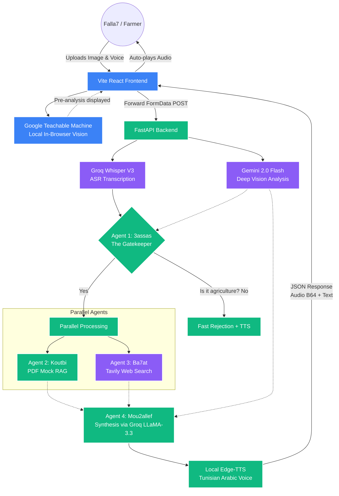

# 🌿 Falla7 AI: Full-Stack Tunisian Agriculture Assistant

Falla7 AI is an end-to-end hackathon solution designed specifically to empower Tunisian olive farmers. It merges a sleek, React-based frontend with a powerful, asynchronous multi-agent Python backend. The app natively supports voice queries, image classification, real-time web searches, and automatic localization into Tunisian Darija via localized text-to-speech.

## 🏗️ Full-Stack Architecture & Workflow



## 🚀 Features
1. **Interactive Glassmorphism UI**: Built with React and Vite. It locally runs a Google Teachable Machine model to give farmers immediate feedback before querying the cloud.
2. **Four-Agent System**:
   - **3assas (Gatekeeper)**: Blocks irrelevant queries (runs on Groq LLaMA 3.3).
   - **Koutbi (Librarian)**: RAG querying for standard Tunisian olive practices.
   - **Ba7at (Researcher)**: Hooks into Tavily to browse the live internet for weather and news.
   - **Mou2allef (Synthesizer)**: The core Groq LLM agent that formats all external and internal data into extremely natural, spoken Tunisian Darija.
3. **Multimodal**: Uses Gemini `2.0-flash` for vision debugging and Groq Whisper for zero-latency speech-to-text.

## 📦 Deployment Instructions

The project is structured efficiently for CI/CD environments.

### Backend (Railway)
1. Go to **Railway.app** and link this GitHub repository.
2. Under deployment settings, set the **Root Directory** to `/chatbot`.
3. The `Procfile` at the root guarantees the FastAPI `uvicorn` instance spins up properly.
4. Set your Environment variables in Railway: `GEMINI_API_KEY`, `GROQ_API_KEY`, `TAVILY_API_KEY`.
5. Note and save the production URL Railway exposes.

### Frontend (Vercel)
1. Go to **Vercel.com** and import this GitHub repository.
2. Vercel automatically detects the Vite config and will build the root folder exactly as defined in `package.json`.
3. In Environment Variables, set `VITE_API_URL` to your live Railway backend URL (ensure there's no trailing slash, e.g. `https://falla7-production.up.railway.app`).
4. Click Deploy. Vercel acts as your CDN and securely hooks into your backend.

## 💻 Running Locally

Requirements: Node 18+ and Python 3.10+

```bash
# Terminal 1: Spin up the Python backend
cd chatbot
python -m venv venv
source venv/bin/activate  # (Windows: venv\Scripts\activate)
pip install -r requirements.txt
uvicorn main:app --reload

# Terminal 2: Spin up the Vite frontend
npm install
npm run dev
```
