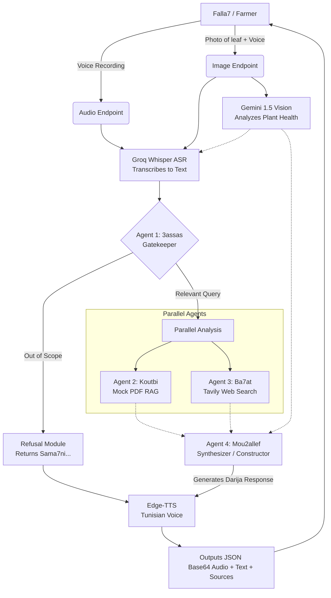

# 🌿 Falla7 AI: Agentic Workflow for Tunisian Olive Farmers

Falla7 AI is a highly specialized, agent-based backend designed for Tunisian olive farmers. It processes multimodal inputs (voice recordings and pictures), runs the inputs through a strict anti-hallucination gatekeeper, retrieves knowledge from internal and external sources in parallel, and synthesizes a friendly response in Moroccan/Tunisian Darija via text-to-speech.

## 🏗️ Architecture & Agentic Workflow



## 🤖 The 4-Agent System

This backend leverages a multi-agent orchestrated pattern running entirely through async processing for high speed.

1. **🛡️ Agent 1 (3assas - The Gatekeeper)**
   Protects the backend from hallucinations, off-topic prompts, or abuse. If the prompt does not relate directly to Tunisian agriculture, olive planting, weather, or crops, it immediately short-circuits the pipeline with a polite response: *"Sama7ni, ena n3awnek ken fil zaytoun."* 

2. **📚 Agent 2 (Koutbi - The Librarian)**
   Acts as the internal Retrieval-Augmented Generation (RAG) system. For the purposes of the hackathon, it searches against a sophisticated mock textbook (MOCK_KB variable) detailing specific Tunisian olive trees like Chemlali and Chetoui.

3. **🔍 Agent 3 (Ba7at - The Researcher)**
   Provides grounding in reality by dynamically fetching real-time web searches using the **Tavily API**. Highly useful for checking impending weather risks (like storms or droughts) or catching up on recent agricultural market news.

4. **✍️ Agent 4 (Mou2allef - The Constructor)**
   The core reasoning synthesizer powered by **Gemini**. It intercepts the user's intent, the gatekeeper's blessing, the Vision model's observations, Koutbi's PDF snippets, and Ba7at's live weather to craft an educated, encouraging, and friendly response in **Tunisian Darija (Arabizi)**.

## 🚀 Endpoints

### 1. `POST /api/process-audio`
**Purpose**: General farming advice and troubleshooting.
**Payload**: `multipart/form-data` containing a `file` (a `.wav`, `.m4a`, or `.mp3` recording).
**Operation**: Transcribes with Groq Whisper-v3-large, executes the agent pipeline, and returns the response logic.

### 2. `POST /api/process-image`
**Purpose**: Disease & Pest diagnosis.
**Payload**: `multipart/form-data` containing a `voice_query` (audio) and an `image` (the photo of the leaf or soil).
**Operation**: Evaluates the image with Gemini's vision capability, transcribes the voice, and provides context-aware guidance.

## 🛠️ Usage

1. Create a `.env` in the `agents/` folder and populate it:
   ```env
   GROQ_API_KEY=your_key
   GEMINI_API_KEY=your_key
   TAVILY_API_KEY=your_key
   ```
2. Install requirements via `pip install -r requirements.txt`.
3. Start the process with `uvicorn main:app --reload`.
4. Test the API easily at `http://localhost:8000/docs`.

---
*Note: The project uses the latest `google.genai` SDK for Gemini interactions.*
